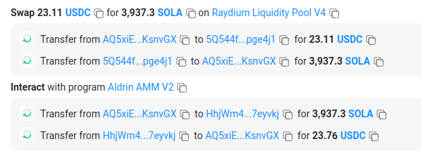

# Solana On-Chain Atomic Arbitrage Analysis

An atomic arbitrage is a risk-free (excluding transaction fee) arbitrage that happens on-chain with the entire trip (buy and sell) happening in a **single transaction**.

Unlike a regular arbitrage event that might happen on a CEX or in any other form, there is zero risk of holding unsellable stock because if the arbitrage closes before the sale can be realized, the Solana transaction will fail and all accounts involved will remain unchanged.

## Aims

- Analyse Solana atomic arbitrage opportunities
- Understand the current players to determine if there is opportunity to compete
- Explore what tokens are more susceptible to the arb

